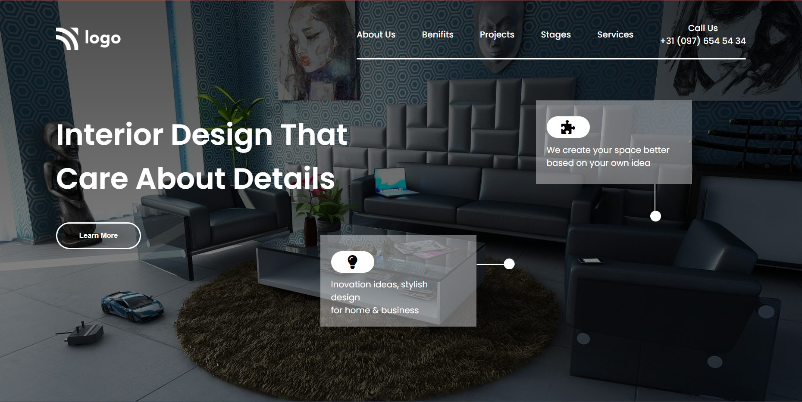

# Assignment 10

## Project 10 [Live Link](https://interior-design-landingpage-tau.vercel.app)

-   Skills Gained in this project
    -   Learned to use **background-image** with **lienar-gradient**.

---

## Time taken to finish this project

-   1 hour taken to complete it.

#### Screenshot

